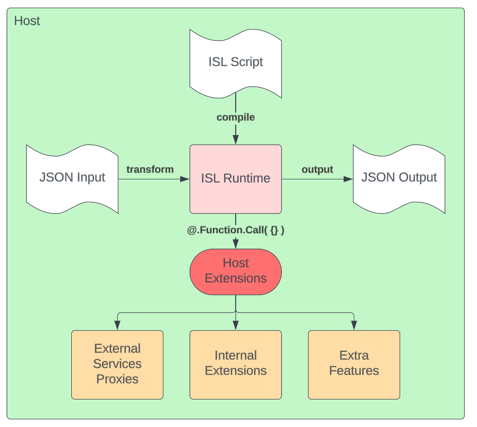

Embedding the ISL in your own Java/Kotlin project to add scripting features is straight forward.

## Overview



1. You host the ISL Runtime (see below)
2. You feed an ISL script to the runtime to _compile_ it. This give you back a thread-safe, cacheable and reusable `Transformer` class.
3. You create an `OperationContext` every time you want to transform a payload. This is basically your execution call stack. Don't reuse them as they are not thread safe.
4. You extend your context with your own Host Extensions functions like `@.Call.Api({})` or `@.Properties.Get( ... )`
5. You feed a JSON `input` into one of the the `Transformer.runTransform*` together with the context and you'll get back the transformed `output`
6. If your ISL calls any of your extensions you registered in step 4. then ISL will call you back to execute that code and wait for a result.

## Existing Hosts:

ISL can be hosted in any JVM-based application. Check the repository examples for implementation patterns.

## Hello World in ISL and Java

The ISL has two modes in which is can operate:

1. Single File where the complete script is one file. Multiple `fun`ctions and `modifier`s can reside in the file and can call each other. No `import` statements are supported.

2. Package where multiple files are loaded together as a single package.
   Each `import` and function call across modules is processed, evaluated and hard-wired at compilation time.

## How to run an ISL File

See Sample ISL Java Host in the test directory.

1. Make sure your project is using at least `Java 11`
2. Add the required dependencies to your build file (Maven or Gradle).
3. Check the releases page for the latest ISL version.

   ```xml
   <!-- ISL Transforms -->
   <dependency>
   	<groupId>com.intuit.isl</groupId>
   	<artifactId>isl-transform</artifactId>
   	<version>${isl.version}</version>
   </dependency>
   ```

4. Load and _Compile_ the script. You can hang on to the compiled script and run it as many times as you want. Once compiled a script is thread-safe.

   ```java
   public JsonNode runScript(String script, String functionName){
   	// name of the script and contents of the ISL script.
   	// This t is cache-able, reusable and thread-safe
   	var t = new TransformCompiler().compileIsl("myscript.isl", script, null);


   	// prepare an operation context - this is NOT thread safe so don't reuse it
   	var context = new OperationContext();

   	// Here you can inject a command interceptor

   	// Optional: add any custom variables you want accessible in the script
   	var myVariable = "hi there";
   	context.setVariable("$myVar", JsonConvert.INSTANCE.convert(myVariable), false);

   	// You can also add Readonly variables or Global Readonly Variables
   	// Readonly variables can't be changed while Global variables are passed along from function call to function call

   	var globalValue = "1234";
   	// readonly: true, global: True
   	var transformVariable = TransformVariable( JsonConvert.INSTANCE.convert(globalValue), true, true );
   	context.setVariable("$myVar", transformVariable);


   	// Optional: Register Custom callback extension methods
   	// This will be available from the script as @.MyService.DoStuff( ... )
   	context.registerJavaExtension("MyService.SayHello", this::sayHello);

   	// Run the Script
   	var result = t.runTransformSync(functionName, context);
   	return result;
   }

   // Custom Java ISL Extension method @.MyService.SayHello( param )
   public Object sayHello(FunctionExecuteContext context){
   	// context.getParameters(); - list of parameters passed to the method
   	// context.getFirstParameter(); - fist parameter passed to the method

       // check your parameters and do some processing. Most parameters are some flavour of JsonNode objects

   	// To Get a valid string use "ConvertUtils.Companion.tryToString"
   	String name = ConvertUtils.Companion.tryToString(context.getFirstParameter());

       return "Hi " + name;
   }
   ```

5. Run your script:

   ```java
   var script = """
   	fun myFunction(){
   		$t = {
   			prop1: $myVar;
   			prop2: @.MyService.SayHello ( 'James' );
   		}

   		return $t;
   	}
   	""";

   // run the `myFunction` inside the script
   var result = runScript(script, "myFunction");
   System.out.println( "Result:\n" + result.toPrettyString() );
   ```

6. Expect the result to be:
   ```json
   {
     "prop1": "hi there",
     "prop2": "Hi James"
   }
   ```

## Registering Custom Modifiers

Custom Modifiers are used to [extend the ISL with the new `|` modifiers](../language/functions.md#modifiers).

1. Register custom modifiers:

   ```java
   // Optional: Register Custom modifier extension methods
   // Notice that modifiers have a prefix of `Modifier.`
   context.registerJavaExtension("Modifier.MyModifier", this::MyModifier);
   ```

   Call your modifier using the common `|` syntax:

   ```isl
   $t = {
   	prop1: $myVar | MyModifier
   }
   ```

2. Add More variables to your hosted runtime:
   ```java
   context.setVariable("$otherVar", JsonConvert.INSTANCE.convert(myVariable), false);
   ```

## Registering Custom Interceptors

Custom Interceptors can be used to monitor the execution of the ISL Script.

1. Command Interceptors
   The Isl runtime supports Command Interceptors that can be used to trace or log the execution of the commands in the ISL.

   ```java
   /**
    * Example of how to write an interceptor that can log various calls.
   * You can even modify the context or the arguments to the call if you are so inclined
   */
   public class LogCommandInterceptor implements ICommandInterceptor {
   	@Override
   	public void onExecuting(@NotNull IXCommand command, @NotNull ExecutionContext context, @NotNull Object[] arguments) {
   		System.out.println("Executing " + command + " args: " + Arrays.toString(arguments));
   	}

   	@Override
   	public void onIssue(@NotNull IXCommand command, @NotNull ExecutionContext context, @NotNull Object[] arguments, @NotNull String message) {
   		System.out.println("Issue " + command + " args: " + Arrays.toString(arguments) + " : " + message);
   	}
   }
   ```

   Most commands will report back at runtime through this interface their execution status.
   To activate this interceptor you need to set it on the `OperationContext`:

