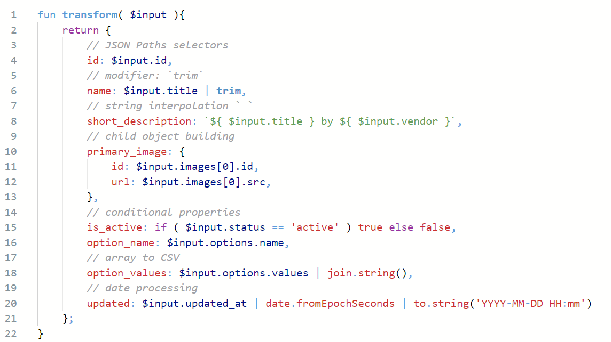

In the most simple form the ISL is a JSON transformation language:

Given Input JSON:
```json
{
	"title": "IPod Nano - 8GB",
	"body_html": "It's the small iPod with a big idea: Video.",
	"id": 632910392,
	"images": [
		{
			"id": 850703190,
			"src": "http://example.com/burton.jpg",
		}
	],
	"options": {
		"name": "Color",
		"values": [
			"Pink",
			"Red",
			"Green",
			"Black"
		]
	},
	"status": "active",
	"tags": "Emotive, Flash Memory, MP3, Music",
	"updated_at": 1645004735,
	"vendor": "Apple"
}
```

And Transformation:


Will output:
```json
{
	"id": 632910392,
	"name": "IPod Nano - 8GB",
	"short_description": "IPod Nano - 8GB by Apple",
	"primary_image": {
		"id": 850703190,
		"url": "http://example.com/burton.jpg"
	},
	"is_active": true,
	"option_name": "Color",
	"option_values": "Pink,Red,Green,Black",
	"updated": "2022-02-47 09:45"
}
```


# Structure
ISL Code is structured as any programming language in multiple sections:

1. `import` of other ISL files
2. `type` definitions
3. [`fun`ctions](./language/functions.md)
4. [`modifier` functions](./language/modifiers.md)


```isl
// Import Other Files
import Common from 'common.isl';

// Type Definitions
type Address as { line1: String, line2: String, postCode: String }

// Apply a basic transformation
fun transformCustomer( $customer ){
    // Build and return a new object
    return {
		// shape your result: select the value
        firstName: $customer.first_name,
        lastName: $customer.last_name,
        
        // String Interpolation
        fullName: `$customer.first_name $customer.last_name`,

        // Build an Array of addresses
        addresses: [
            {
                // call modifier via | 
                type: $customer.address1.type | addressType,
                line1: $customer.address1.addressLine1 | trim
            }
        ]
    }
}

// Modifiers are applied with | (pipe) syntax
modifier addressType( $type ) {
    // if expressions
    return
        if( $type == 'home' ) 'HomeAddress' 
        else 'BusinessAddress';
}

```

## Language Basics
- Variables are declared with the prefix `$`.
- Selecting values from a variable is done using [JSON Path](https://goessner.net/articles/JsonPath/index.html#e2) expressions
    - `$value.property`
    - Selections will return `null` if they can't be fully evaluated.
- Anything and everything is an _expression_ that can be captured in a variable, object or property.
    - [for loops](./language/loops.md) return the result as an array `[...]`.
    - [if/switch](./language/conditions.md) return the expression result.
- Conditions work on a [_true-ish_ and _false-ish_ approach](./language/conditions.md) close to the JavaScript conditions.
- [Objects & Arrays](./language/objects.md) are built natively using `{ ... }` and `[...]`.
- Property Names in Objects don't require `"` unless they contain special characters `{ name: $value }` or `{ "name": $value }`are equivalent.
- [Functions](./language/functions.md) are called using `@.` prefix with `@.This.` representing the current file.
    - `@.This.transformCustomer( $customer )`
- [String Interpolation](./types/strings.md) can be used `to build complex strings with ${ $variables } or @.Function.Calls()`.
